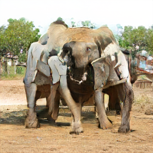

# Lecture Slides

- [Part 1](https://docs.google.com/presentation/d/1uohkrAUQQMDPmoL5z30wwlVVCiMMHOwsoWIfN5f0X94/edit?usp=sharing)
- [Part 2](https://docs.google.com/presentation/d/1_suUTGUlkn6JW2AySr1DkGp1sLi_3zraEXEiWZV3Iwo/edit?usp=sharing)

# Links

- [ML4A - _Machine Learning for Artists_](https://ml4a.github.io/)
- [Wekinator](http://www.wekinator.org/)
- [NVIDIA summary of a project with Sofia Crespo](https://www.nvidia.com/en-us/deep-learning-ai/ai-art-gallery/artists/?artist=artist-3-sofia-crespo)
- [MIT - Deep Learning for Art, Aesthetics and Creativity](https://www.youtube.com/playlist?list=PLCpMvp7ftsnIbNwRnQJbDNRqO6qiN3EyH)
- [ML5](https://ml5js.org/)
- [P5js](https://p5js.org/)
- [RunwayML](https://runwayml.com/)
- [A Style-Based Generator Architecture for Generative Adversarial Networks](https://www.youtube.com/watch?v=kSLJriaOumA&t)

# BigGAN Playground

1. Go to https://colab.research.google.com/
2. Click on the __Github__ tab.
3. Paste in this URL: https://github.com/joshmurr/biodesign_biggan/blob/master/BigGAN_Playground.ipynb
4. Click on the magnifying glass (do not click 'New Notebook').
